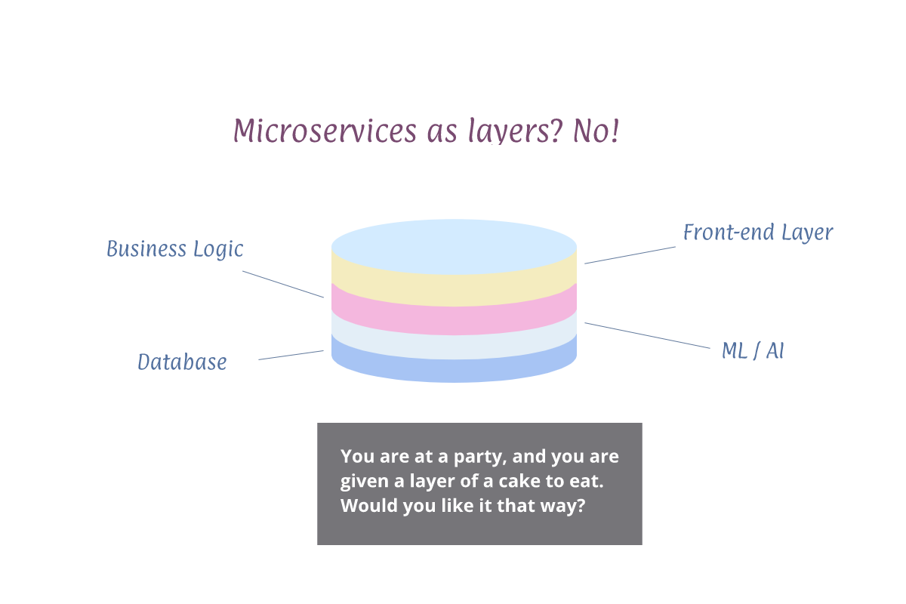

# microservices-reactjs

## What are microservices, anyway?

* The wrong way *

A lot of the tutorials and blog post out there start with splitting the monolith into microservices, where each technology layer is made a microservice

* The right way *

But the correct way to split into microservices is when each one of them will be self contained unit with its own data:

